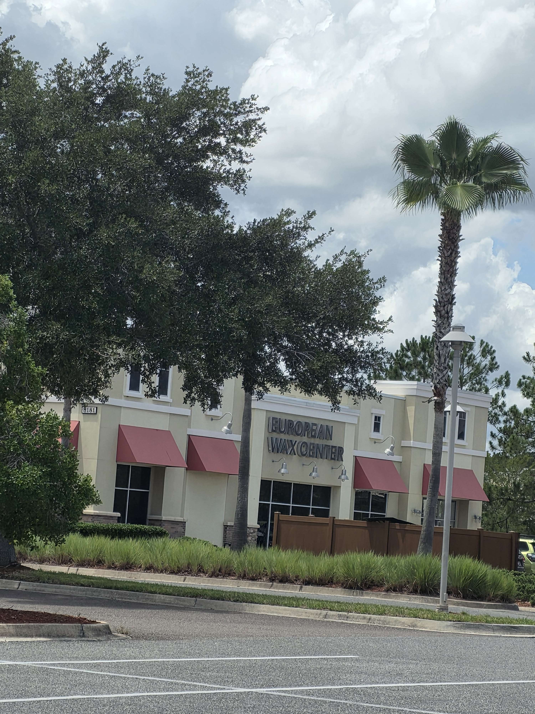
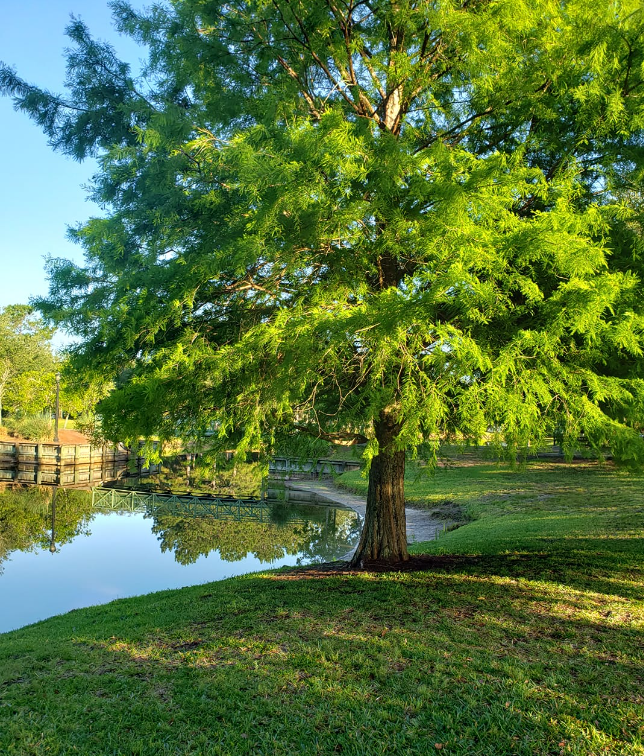

<html lang="en">
<head>
  <meta charset="UTF-8" />
  <meta name="viewport" content="width=device-width, initial-scale=1.0" />
  <title>InSight Services</title>
  <link rel="stylesheet" href="index.css">
</head>
<body>
  <header>
    

      

        
        <h3>Where your dream home becomes reality</h3>
      

      
&#9776;

    

    <nav id="myLinks">
      <ul>
        <li><a href="index.htm">Home</a></li>
        <li><a href="#">Forms</a></li>
        <li><a href="#">Services</a></li>
        <li><a href="#">Locations</a></li>
        <li><a href="contact.htm">Contact</a></li>
      </ul>
    </nav>
  </header>

  <main>
    <section class="content">
      <h2>About Us</h2>
      
Thank you for visiting InSight Services. We are a privately owned company specializing in the purchasing and selling of properties. For the last 30 years, we have been serving the people of Northeast Florida. We look forward to helping you in your home-buying journey.

      
Additional text can be added here as needed. This is placeholder content.

      
We are available 7 days a week. Please call or text us at <a href="tel:1234567890">123-456-7890</a> or email us at <a href="mailto:thisisatest@gmail.com">thisisatest@gmail.com</a>.

    </section>
  </main>

      
Here are some recently listed homes

  <section class="listings-section">
    

      <!-- Listing with slider and Sold status -->
      

        

          <button class="prev-btn">&#10094;</button>
          

            
            
            
          

          <button class="next-btn">&#10095;</button>
        

        
Sold

        

          <h2>$599,000</h2>
          
1234 Elm Street, Springfield, IL

          
Beautiful 4-bedroom family home...

          <ul class="features">
            <li>🛏️ 4 Beds</li>
            <li>🛁 3 Baths</li>
            <li>📐 2,400 sqft</li>
            <li>🌳 Large backyard</li>
            <li>🚗 2-car garage</li>
          </ul>
          <a href="#" class="btn">Schedule a Tour</a>
        

      

            

        

          <button class="prev-btn">&#10094;</button>
          

            
            
            
          

          <button class="next-btn">&#10095;</button>
        

        
Active

        

          <h2>$599,000</h2>
          
1234 Elm Street, Springfield, IL

          
Beautiful 4-bedroom family home...

          <ul class="features">
            <li>🛏️ 4 Beds</li>
            <li>🛁 3 Baths</li>
            <li>📐 2,400 sqft</li>
            <li>🌳 Large backyard</li>
            <li>🚗 2-car garage</li>
          </ul>
          <a href="#" class="btn">Schedule a Tour</a>
        

      

            

        

          <button class="prev-btn">&#10094;</button>
          

            
            
            
          

          <button class="next-btn">&#10095;</button>
        

        
Under-contract

        

          <h2>$599,000</h2>
          
1234 Elm Street, Springfield, IL

          
Beautiful 4-bedroom family home...

          <ul class="features">
            <li>🛏️ 4 Beds</li>
            <li>🛁 3 Baths</li>
            <li>📐 2,400 sqft</li>
            <li>🌳 Large backyard</li>
            <li>🚗 2-car garage</li>
          </ul>
          <a href="#" class="btn">Schedule a Tour</a>
        

      

      <!-- Add more listings below using same structure -->

    

  </section>

    <section class="listings-section">
    

      <!-- Listing with slider and Sold status -->
      

        

          <button class="prev-btn">&#10094;</button>
          

            
            
            
          

          <button class="next-btn">&#10095;</button>
        

        
Pending

        

          <h2>$599,000</h2>
          
1234 Elm Street, Springfield, IL

          
Beautiful 4-bedroom family home...

          <ul class="features">
            <li>🛏️ 4 Beds</li>
            <li>🛁 3 Baths</li>
            <li>📐 2,400 sqft</li>
            <li>🌳 Large backyard</li>
            <li>🚗 2-car garage</li>
          </ul>
          <a href="#" class="btn">Schedule a Tour</a>
        

      

            

        

          <button class="prev-btn">&#10094;</button>
          

            
            
            
          

          <button class="next-btn">&#10095;</button>
        

        
Sold

        

          <h2>$599,000</h2>
          
1234 Elm Street, Springfield, IL

          
Beautiful 4-bedroom family home...

          <ul class="features">
            <li>🛏️ 4 Beds</li>
            <li>🛁 3 Baths</li>
            <li>📐 2,400 sqft</li>
            <li>🌳 Large backyard</li>
            <li>🚗 2-car garage</li>
          </ul>
          <a href="#" class="btn">Schedule a Tour</a>
        

      

            

        

          <button class="prev-btn">&#10094;</button>
          

            
            
            
          

          <button class="next-btn">&#10095;</button>
        

        
Sold

        

          <h2>$599,000</h2>
          
1234 Elm Street, Springfield, IL

          
Beautiful 4-bedroom family home...

          <ul class="features">
            <li>🛏️ 4 Beds</li>
            <li>🛁 3 Baths</li>
            <li>📐 2,400 sqft</li>
            <li>🌳 Large backyard</li>
            <li>🚗 2-car garage</li>
          </ul>
          <a href="#" class="btn">Schedule a Tour</a>
        

      

      <!-- Add more listings below using same structure -->

    

  </section>

  <footer>
    
&copy; InSight Services Inc.

  </footer>

  
</body>
</html>
